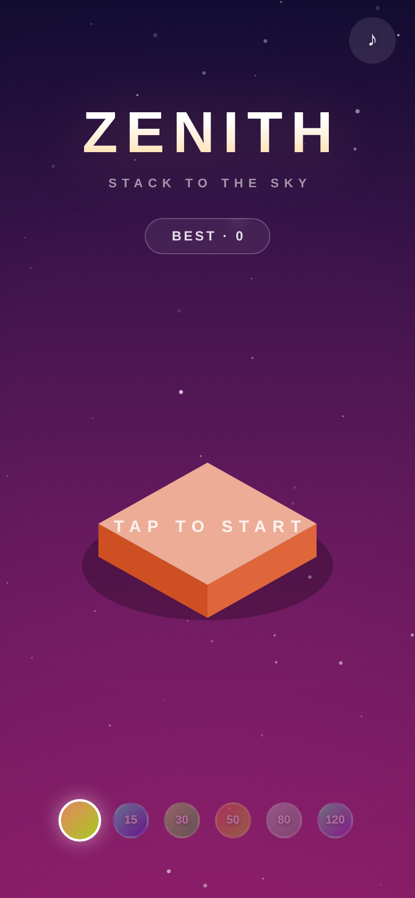
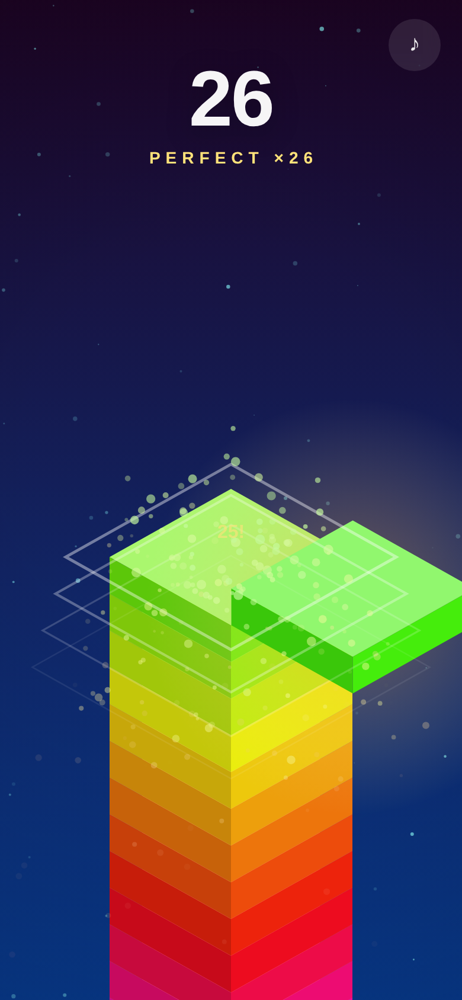
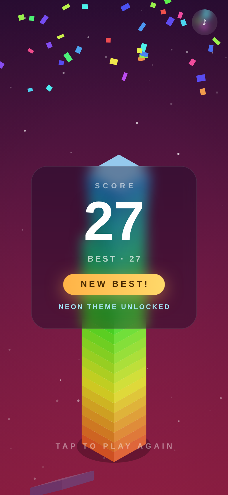
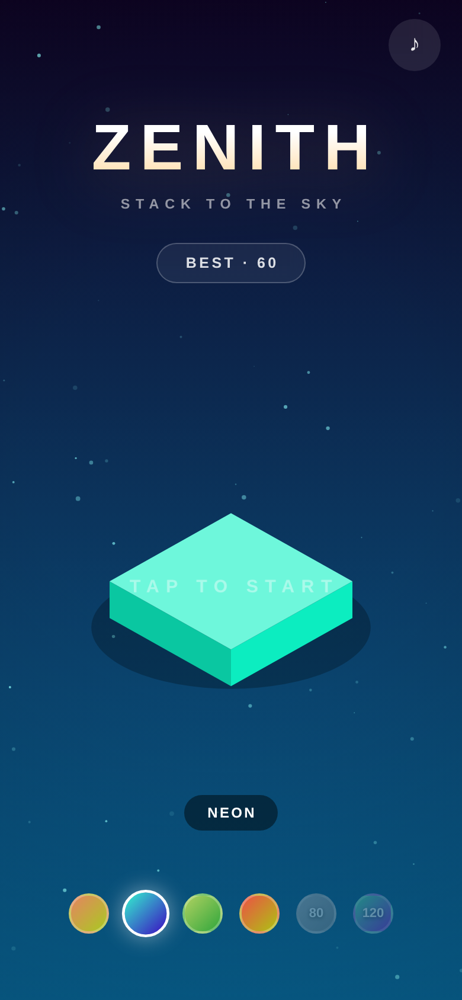

# ZENITH — Stack to the Sky

A one-touch precision tower game built for mobile. Tap to drop the sliding block onto the tower; whatever hangs over the edge gets sliced off. Land it perfectly and the tower sings — chain perfects to regrow your block and climb higher.

**Zero dependencies. Zero assets to download. ~30 KB of hand-written HTML, CSS and JavaScript.** All sound is synthesized live with WebAudio; all graphics are drawn with Canvas 2D.

<p align="center">
  
  
  
  
</p>

## Play

Serve the folder with any static server and open it on your phone (or a mobile-sized browser window):

```bash
npx serve .          # or: python3 -m http.server 8000
```

Tap anywhere to start. Tap to drop. That's the whole tutorial.

It also installs as a PWA — "Add to Home Screen" gives you a fullscreen, offline-capable app with its own icon.

## How it plays

- **One mechanic, understood in 3 seconds.** A block slides back and forth above the tower; tap to drop it. Overhang is sliced off and tumbles away, so every miss physically shrinks your landing target — the game gets harder *because* you erred, which keeps every death feeling fair.
- **Perfect drops** (within a forgiving tolerance, extra-generous for the first few blocks) snap into place with an expanding ring, a particle burst, and a chime that climbs a pentatonic scale with every consecutive perfect — the longer the streak, the higher the music.
- **Regrowth reward:** chain 3+ perfects and your block regains width, the only way to recover from earlier mistakes.
- **Milestones** every 25 blocks land with a warm chord and a burst.
- **Death is cinematic:** a 150 ms hit-stop, screen shake, then the camera pulls back to admire the full tower you built before the score card slides in. Restart is one tap, under a second.

## Retention, done ethically

No lives, no timers, no ads, no currencies. Progression is pure mastery:

- Best score with a **NEW BEST!** confetti celebration
- **Six color themes** unlocked at score milestones (15 / 30 / 50 / 80 / 120) — cosmetic only
- Lifetime stats: games played, total blocks, best perfect streak
- Everything persists in `localStorage`

## Built on research

The design distills what the hyper-casual canon (Stack, Flappy Bird, Crossy Road, Helix Jump) gets right:

| Principle | Implementation |
|---|---|
| Compulsion loop | goal → attempt → feedback → restart in <1 s |
| Near-miss engine | every tap is continuously graded; deaths are always your fault |
| Variable reward | combo ladder, regrowth, milestone moments |
| Juice | squash-and-stretch landings, screen shake scaled to overhang, hit-stop, haptics, pitch-randomized synth SFX |
| Flow | speed ramps ~2%/block with early forgiveness; the shrinking platform self-balances difficulty |
| Visual hook | hue-shifting sky as you climb, rainbow block sweep, parallax starfield |

## Architecture

| File | Role |
|---|---|
| `index.html` | Markup + all CSS (HUD, title, game-over, theme picker) |
| `game.js` | Engine: state machine, 2.5D isometric renderer, physics for debris/particles/confetti, WebAudio synth, persistence, input |
| `sw.js` | Service worker — cache-first, fully playable offline |
| `manifest.json`, `icon.svg`, `icons/` | PWA install metadata and app icons |
| `tools/make_icons.py` | Regenerates the PNG icons from the vector design |

Rendering is a single `requestAnimationFrame` loop with delta-time updates, `devicePixelRatio`-aware scaling, and an axonometric projection (`project(x, z, y)`) shared by blocks, debris, particles, rings and floating text. Input is one `pointerdown` listener on the window — the whole screen is the button.

Append `?debug` to the URL to expose `window.__zenith` (deterministic drops for automated testing).

## License

Apache-2.0 — see [LICENSE](LICENSE).
